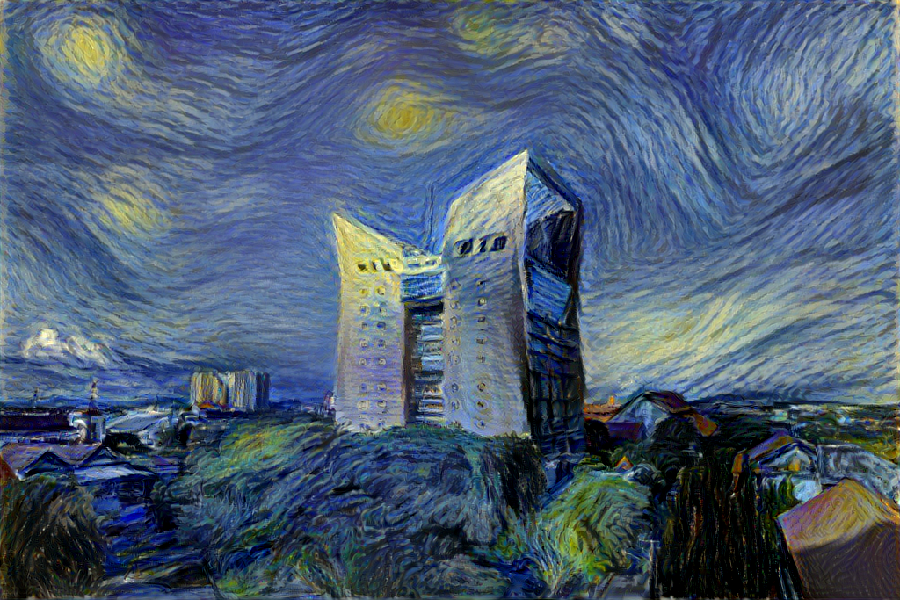
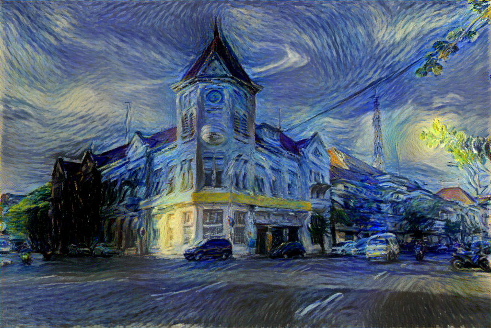
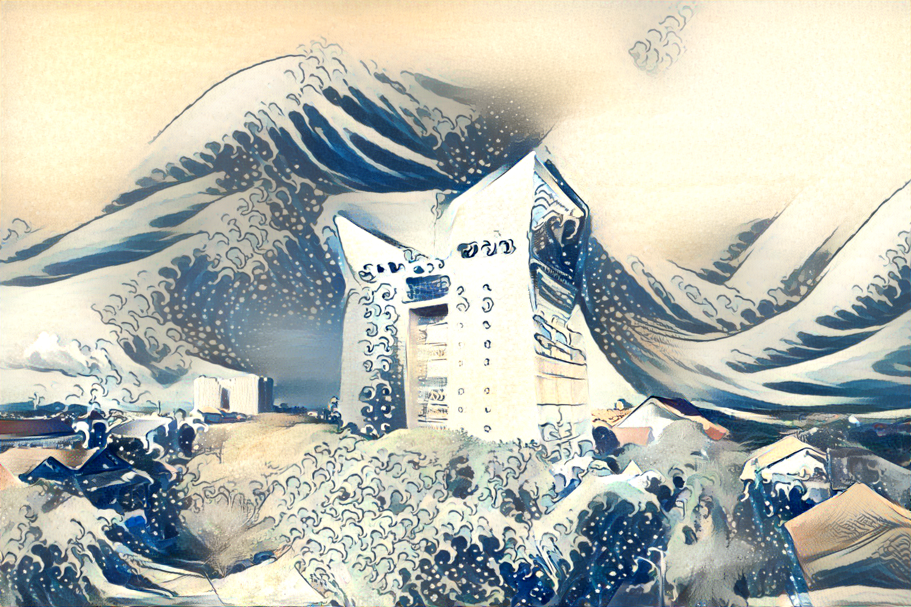
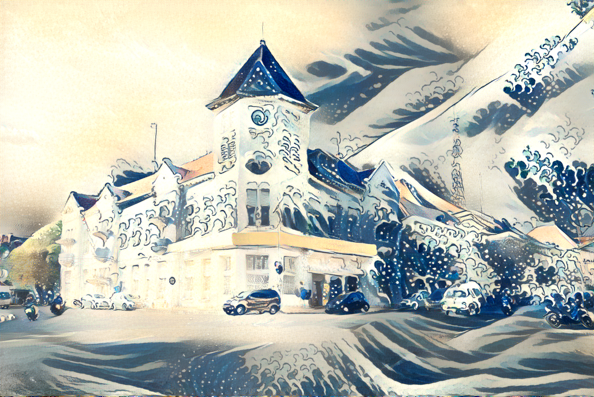
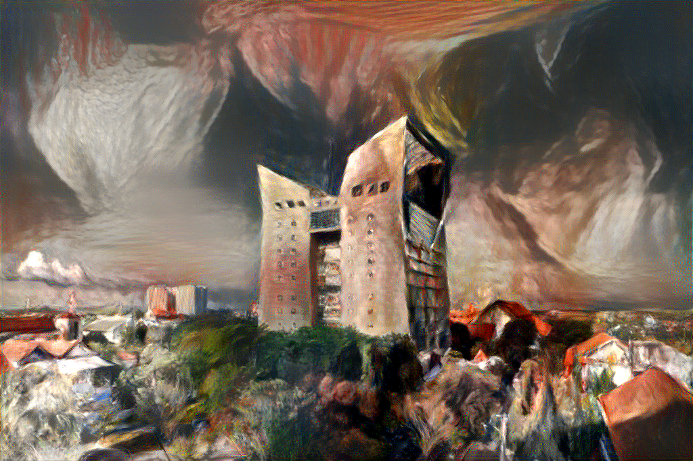
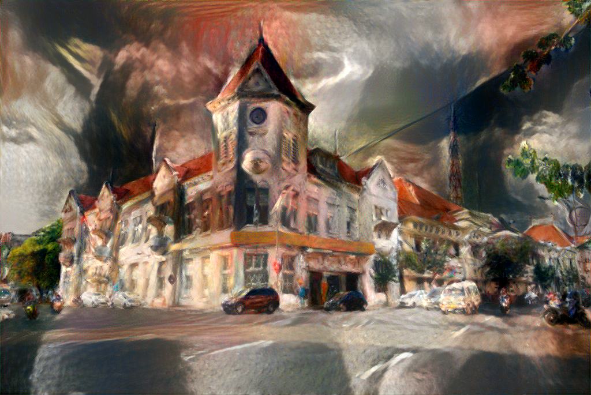
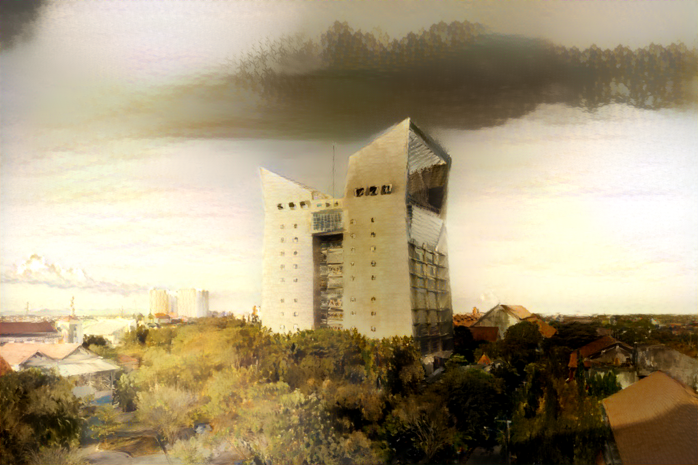
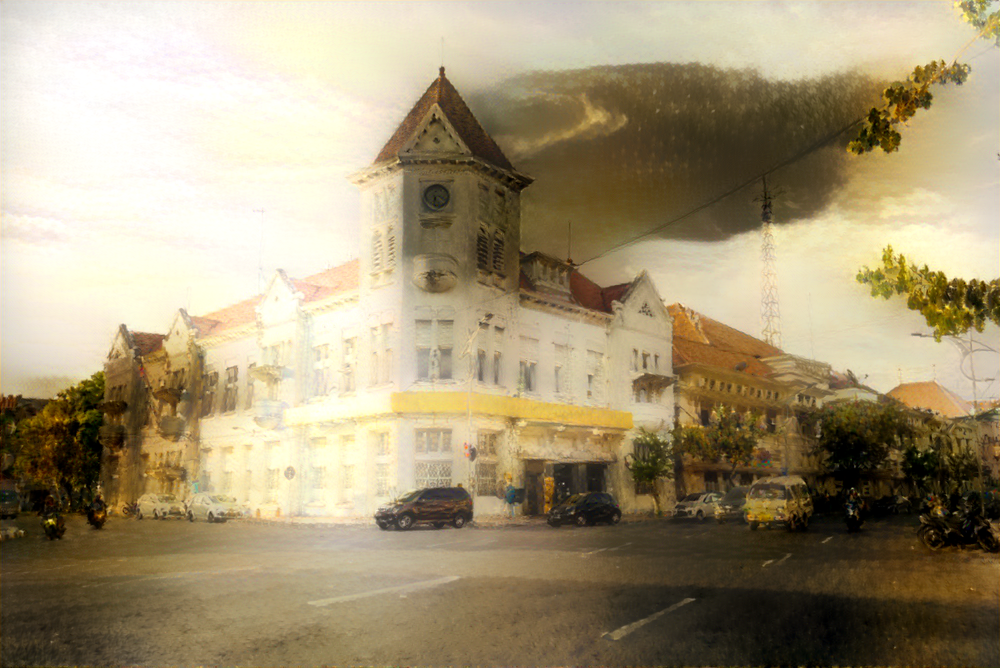
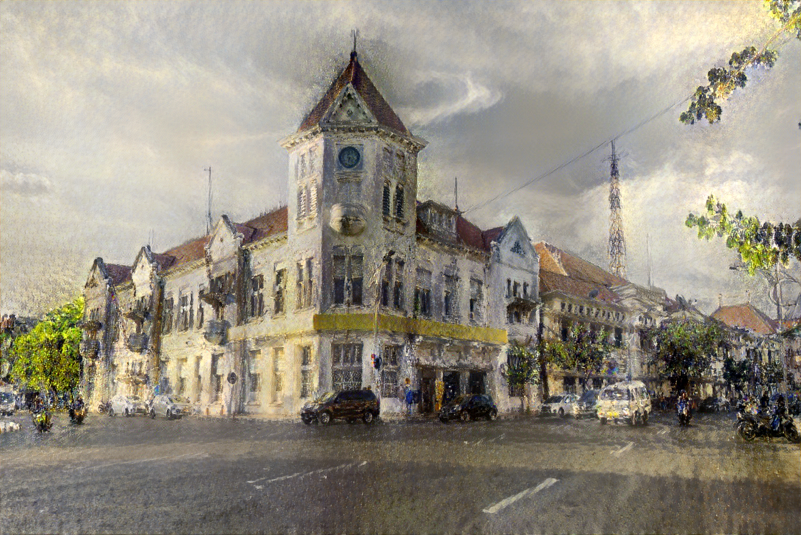
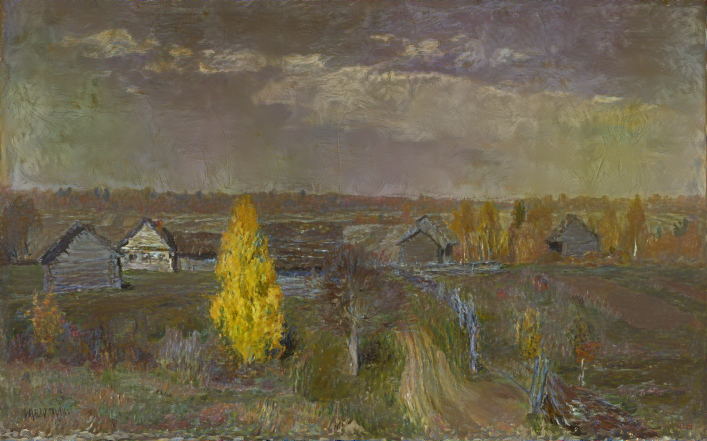

# surabaya on various multi style transfer learning


original image |  starry night
:-------------------------:|:-------------------------:
  |  
  |  


original image | great wave off
:-------------------------:|:-------------------------:
  |  
  |  


original image | Luncheon of the Boating Party
:-------------------------:|:-------------------------:
  |  
  |  


original image | levitan
:-------------------------:|:-------------------------:
  |  
  |  


original image | montmartre
:-------------------------:|:-------------------------:
  |  
  |  


"**insert famous painters name** painted **insert painting with different style**"




## training
at initiation, uses a random image perception,     
using the bash script, all the pictures were trained 10 times where each layer were configured like this, gradually increasing on `image_size`, and `init_image` based on previous result:


```bash

python3 neural_style.py \
  -content_image examples/inputs/its.jpg\
  -style_image wave_off.jpg\
  -init image -init_image out5.png \
  -style_scale 1.0 \
  -print_iter 10 \
  -style_weight 2500 \
  -image_size 1024 \
  -num_iterations 2000 \
  -output_image out6.png \
  -tv_weight 0 \
  -gpu 0 \
  -backend cudnn

```


## tpu vs gpu
running on `starry_bigger_time.sh`, measured on `time_check.py`
- gpu@colab time: 3045.925956964493 s 
- gpu@p5000 time: 971.1943960189819 s 


## todo: 
- work on some styles: 
    - [ ] handwriting 
    - [ ] maps (tangerang, surabaya)
- [ ] change to celery worker
- [ ] make some quasi front end, either flask or telegram bot
    kebutuhan demo bray

## credits
- [original project based on neural algorithm of artistic style pytorch implementation](https://github.com/ProGamerGov/neural-style-pt)
- [a code based on](https://github.com/jcjohnson/neural-style)
- [original paper](http://arxiv.org/abs/1508.06576)
